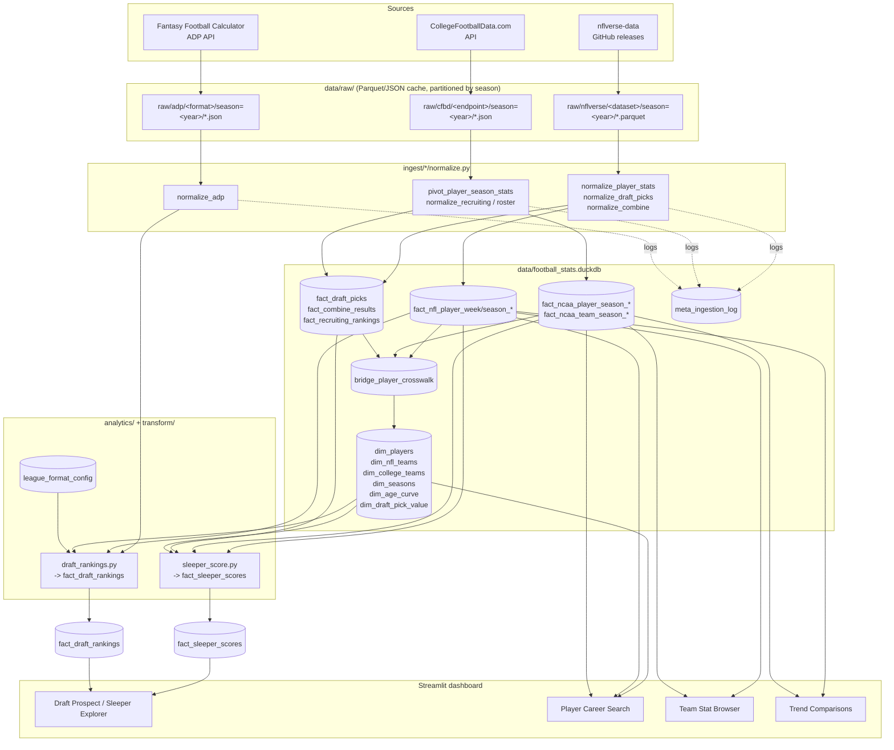

# Architecture Diagram

This supersedes `NFL_ERD.drawio.png`, which only modeled the old NFL-only
star schema from the pre-rearchitecture `Fantasy_Football/` scraper. Two
diagrams: a data-flow flowchart (ingestion → storage → analytics →
dashboard) and an entity-relationship diagram covering the schema from
Appendix A Section 3 plus the additions from `docs/architecture-review.md`
and `docs/draft-strategy.md`.

---

## 1. Data flow

---

## 2. Entity-relationship diagram

Covers Appendix A Section 3 (dimensions, NFL facts, NCAA facts,
draft/combine/recruiting, crosswalk) plus the draft-strategy tables from
`docs/draft-strategy.md` and the ingestion-log table from
`docs/architecture-review.md`. Columns are abbreviated to keys and the
fields most relevant to relationships/joins — see the respective `sql/schema/*.sql`
files (Appendix A Section 3) for full column lists.

```mermaid
erDiagram
    dim_players {
        varchar player_id PK
        varchar gsis_id
        varchar pfr_id
        varchar cfbd_id
        varchar full_name
        varchar position
        date birth_date
        varchar college
        int draft_year
        int draft_round
        int draft_pick
    }

    dim_nfl_teams {
        varchar team_abbr PK
        varchar team_name
        varchar team_conference
        varchar team_division
    }

    dim_college_teams {
        varchar school PK
        varchar conference
        varchar division
    }

    dim_seasons {
        int season PK
        varchar season_label
    }

    dim_age_curve {
        varchar position PK
        int age PK
        double value_multiplier
    }

    dim_draft_pick_value {
        varchar pick_type PK
        varchar league_type PK
        double value_score
        double historical_hit_rate
    }

    bridge_player_crosswalk {
        varchar player_id PK
        varchar gsis_id
        varchar pfr_id
        varchar cfbd_id
        varchar match_method
        double match_confidence
    }

    fact_nfl_player_week_offense {
        varchar player_id FK
        int season PK
        int week PK
        varchar season_type PK
        varchar team
        double fantasy_points
        double fantasy_points_ppr
    }

    fact_nfl_player_season_offense {
        varchar player_id FK
        int season PK
        varchar team
        varchar position
        double fantasy_points
        double fantasy_points_ppr
    }

    fact_nfl_player_season_defense {
        varchar player_id FK
        int season PK
        varchar team
    }

    fact_nfl_player_season_kicking {
        varchar player_id FK
        int season PK
        varchar team
    }

    fact_ncaa_player_season_passing {
        varchar player_id FK
        int season PK
        varchar team PK
    }

    fact_ncaa_player_season_rushing {
        varchar player_id FK
        int season PK
        varchar team PK
    }

    fact_ncaa_player_season_receiving {
        varchar player_id FK
        int season PK
        varchar team PK
    }

    fact_ncaa_player_season_defense {
        varchar player_id FK
        int season PK
        varchar team PK
    }

    fact_ncaa_team_season_stats {
        varchar team PK
        int season PK
        varchar stat_name PK
        double stat_value
    }

    fact_draft_picks {
        int season PK
        int draft_pick PK
        varchar gsis_id FK
        varchar cfbd_id FK
        varchar pfr_id
        varchar player_name
        varchar position
        varchar college
    }

    fact_combine_results {
        int season PK
        varchar player_name PK
        varchar position PK
        varchar school PK
        double forty_yard
        double vertical_in
    }

    fact_recruiting_rankings {
        int recruit_year PK
        varchar cfbd_id PK
        varchar name
        int stars
        double rating
    }

    fact_sleeper_scores {
        varchar player_id PK
        varchar position
        int draft_year
        double dominator_rating_final
        double dominator_rating_career
        double breakout_age
        double breakout_age_adjusted
        double sleeper_score
    }

    league_format_config {
        varchar league_format_id PK
        int num_teams
        double pts_per_reception
        varchar league_type
    }

    fact_draft_rankings {
        varchar player_id PK
        int season PK
        varchar league_format_id PK
        double vorp_score
        double adp_overall
        double value_vs_adp
        varchar value_classification
        double dynasty_value_score
    }

    meta_ingestion_log {
        bigint ingestion_id PK
        varchar source
        varchar dataset
        int season
        varchar status
    }

    dim_players ||--o{ fact_nfl_player_week_offense : "player_id"
    dim_players ||--o{ fact_nfl_player_season_offense : "player_id"
    dim_players ||--o{ fact_nfl_player_season_defense : "player_id"
    dim_players ||--o{ fact_nfl_player_season_kicking : "player_id"
    dim_players ||--o{ fact_ncaa_player_season_passing : "player_id"
    dim_players ||--o{ fact_ncaa_player_season_rushing : "player_id"
    dim_players ||--o{ fact_ncaa_player_season_receiving : "player_id"
    dim_players ||--o{ fact_ncaa_player_season_defense : "player_id"
    dim_players ||--o{ fact_draft_picks : "gsis_id"
    dim_players ||--o{ fact_combine_results : "player_name+position"
    dim_players ||--o{ fact_recruiting_rankings : "cfbd_id"
    dim_players ||--|| bridge_player_crosswalk : "player_id"
    dim_players ||--o{ fact_sleeper_scores : "player_id"
    dim_players ||--o{ fact_draft_rankings : "player_id"

    dim_nfl_teams ||--o{ fact_nfl_player_season_offense : "team"
    dim_college_teams ||--o{ fact_ncaa_player_season_passing : "team"
    dim_college_teams ||--o{ fact_ncaa_team_season_stats : "team"

    dim_seasons ||--o{ fact_nfl_player_season_offense : "season"
    dim_seasons ||--o{ fact_ncaa_player_season_passing : "season"

    league_format_config ||--o{ fact_draft_rankings : "league_format_id"
    dim_age_curve ||--o{ fact_draft_rankings : "position+age"
    dim_draft_pick_value ||--o{ fact_draft_rankings : "pick_type"

    fact_draft_picks ||--o{ fact_recruiting_rankings : "cfbd_id"
```

---

## Notes

- `bridge_player_crosswalk` is modeled as 1:1 with `dim_players` (each
  `player_id` has exactly one crosswalk row recording how it was matched —
  `match_method`/`match_confidence` per the 3-tier strategy in Appendix A
  Section 3.5).
- `fact_combine_results` joins to `dim_players` on `(player_name, position,
  school)` rather than a direct ID because PFR-sourced combine data doesn't
  always carry a `gsis_id`/`pfr_id` — this is exactly the kind of join the
  validation checks in `docs/data-source-validation.md` §4.3/4.4 should
  monitor for coverage rate.
- `dim_age_curve` and `dim_draft_pick_value` (from `docs/draft-strategy.md`
  §5.3) are derived **from the platform's own historical data** once enough
  seasons of `fact_nfl_player_season_offense` and `fact_draft_picks` +
  outcomes exist — they have no external source dependency.
- `meta_ingestion_log` has no FK relationships drawn (it's a log table keyed
  by `(source, dataset, season)` as a logical reference, not enforced via
  DuckDB foreign keys) but is the audit trail for every other table's
  most recent refresh.
